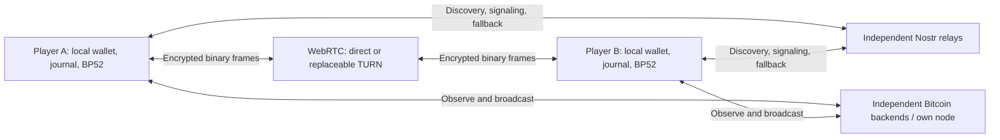

# Decentralized BP52: Nostr rendezvous and WebRTC transport

Status: proposed; September 8, 2026. Planning only; no runtime changes.

## Recommendation and success criterion

Use Nostr for discovery, invitations, authenticated signaling and a bounded
fallback transport. Use WebRTC data channels for the large binary exchanges.
Keep poker validation, signing, durable state and recovery in the clients, and
Bitcoin as the settlement authority. Publish an interoperable BP52 specification
with separate transport bindings.

The release criterion is **no mandatory application operator or individual
infrastructure provider**. Either player can use an independent client and
replace failed infrastructure without changing the funded table. This does not
mean operation without connectivity, an available Bitcoin network, or local
keys and recovery data. An opponent can still stop cooperating; the existing
unilateral settlement path must remain available.

Do not describe a Nostr/WebRTC transport swap alone as full decentralization.
Asset distribution, wallet storage, chain access, discovery and TURN credentials
must also survive removal of our operator.

## What exists today

Source inspection, including the current uncommitted matchmaking work:

| Dependency | Current implementation | Replacement |
| --- | --- | --- |
| Rooms and seat allocation | `apps/relay/src/lib.rs`, `/api/v1/games/*` | Client-generated table identity and bilateral admission |
| Public matchmaking | `apps/relay/src/matchmaking.rs`, `apps/web/src/onchain/matchmaking.js` | Expiring Nostr offers and a peer agreement state machine |
| Message delivery | `relay-socket*.js`, `relay-inbox.js`, `channel-inbox.js` | Transport-independent durable inbox/outbox; WebRTC and Nostr adapters |
| Configuration | `/api/v1/config`, `src/config/deployment.js` | Packaged, locally validated network/rules profile; replaceable service hints |
| Application and Wasm | Assets embedded in the relay executable | Standalone static release, independent mirrors and locally installed client |
| Chain access | Esplora adapter with one configured URL | Multiple independent backends and a user-controlled node option |
| Recovery | Browser IndexedDB, local wallet, browser workers | Preserve local ownership; add origin-independent installed-client storage |

The existing inbox already persists outgoing bytes before transmission and
incoming data before acknowledging receipt. Preserve these invariants, but
replace server epochs, credentials, room cursors and upload acceptance semantics.
An opaque relay is not itself proof that every existing payload is encrypted;
audit the complete message inventory before publishing any traffic to Nostr.

The native `poker-transport-libp2p` crate already separates peer communication
from game state. Use its contracts as input to the shared protocol; do not try
to insert a native TCP/QUIC transport into the browser.

The [binary transport benchmark](../benchmarks/binary-channel-transport.md)
recorded approximately 4.93 MB uploaded per handover and 93.3 MB across setup,
play and future-hand preparation. These are workload samples, not a universal
per-hand cost. They make bulk transfer a first-class design requirement.

## Architecture

Relays never decide a winner, validate a poker move, assign authoritative table
state, store recovery packages or run recovery monitoring. Their delivery and
timestamp claims are untrusted.

### 1. Nostr rendezvous

Start with three independently operated compatible relays. Maintain subscriptions
to a small bounded set; advertise and accept replacement relay hints. Publish
small discovery/signaling events redundantly and deduplicate locally. Proceed
when the peer handshake succeeds over a usable route; do not require a quorum
of relays. A direct connection must survive the loss of every signaling relay.

Relay lists are hints, not an authority. Ship multiple bootstrap choices,
cache known-good endpoints, support advanced overrides, and exchange each peer's
reachable relay set. Discovery needs some shared rendezvous: disjoint relay sets
do not magically find each other. Private invites carry relay hints; public
discovery uses a documented common topic and overlapping independent defaults.
Do not introduce a mandatory relay-directory API.

Use signed NIP-01 events with application-specific schemas. Public offers expose
only version, network/rules identifier, buy-in, ephemeral matchmaking identity,
expiry and connection hints. Private invitations bind the inviter's public key,
random table locator, rules digest and a high-entropy join capability in the URL
fragment. Any compatible client can import the fragment; the hostname is not
part of table identity. Keep capabilities out of public event tags and logs.

Encrypt directed signaling, ICE candidates and fallback frames. NIP-44 defines
encryption, not a game message schema; NIP-17 is a chat convention and should not
be repurposed as poker chat messages. Pin the exact supported encryption profile
and test vectors. NIP-44 alone does not provide forward secrecy. Before funded
use, select and review a standard authenticated session handshake with ephemeral
key agreement, binding both transport identities, the admission transcript,
rules and table context. Do not invent a new cryptographic construction.
Use the resulting application encryption across both WebRTC and Nostr paths.

Prefer ephemeral event kinds for live signaling and packet delivery, with local
retransmission; no durable relay queue is necessary. Discovery can use short-lived
offers with client-enforced expiration. Neither ephemeral semantics nor NIP-40
expiration guarantees that an operator or observer deletes captured traffic.
Public Nostr infrastructure must be treated as able to retain every ciphertext.

Probe actual publish/subscribe behavior and read NIP-11 limits. Handle refusal,
authentication, rate limiting, maximum serialized size and unsupported kinds.
Implement NIP-42 where required; a relay login or payment must not become a
mandatory player onboarding step. Final event-kind numbers need registry review
before publishing the protocol; do not assume a proposed number is available.

### 2. WebRTC and fallbacks

Exchange authenticated SDP and trickle ICE over Nostr. Bind SDP fingerprints and
negotiation generation to the admitted peer; reject stale or substituted offers.
Specify deterministic offerer roles, simultaneous-offer handling, ICE restarts
and reconnect epochs. New connection negotiation never creates a new poker hand.

Use reliable data channels with separate control and bulk lanes. Add an
application scheduler: separate channels still share congestion and do not by
themselves protect action latency. Prioritize live actions, reveals, acknowledgments
and cashout over bounded future-hand preparation. Keep one table connection
across consecutive hands and multiplex unique hand/path contexts through it.

Chunk large payloads, starting with a conservative 16 KiB WebRTC chunk target,
bounded by negotiated `maxMessageSize`. Use `bufferedAmount` backpressure, limits
on concurrent transfers, and resumable missing-range requests. The browser API
placement must be qualified: keep a page-owned WebRTC bridge where required,
while workers retain encryption, durable queues and protocol processing. Do not
assume the current shared socket worker can instantiate `RTCPeerConnection` on
all supported browsers.

Route policy:

1. For private tables, try direct WebRTC with a short deadline, then TURN.
2. For public matches, default to relay-only ICE to avoid exposing a player's
   network address directly to a stranger. Direct connectivity can be an advanced
   opt-in. This recommendation trades bandwidth cost for privacy; test it in the
   initial spike.
3. Configure at least two independent TURN operators, including a TCP/TLS route
   for networks that block UDP. Each must have independently obtainable scoped,
   expiring credentials. One shared credential broker would remain a single
   point of failure. Do not ship permanent TURN secrets in JavaScript.
4. If WebRTC cannot connect, use encrypted, bounded Nostr chunks through relays
   whose policy and measured throughput support the workload. Adapt chunk sizes
   to the entire encoded event, including encryption and base64 overhead.

Do not assume arbitrary social relays will carry tens of megabytes. The fallback
qualification must transfer representative setup and handover artifacts. Bulk
fallback uses a selected route with resumable failover; do not multiply every
bulk byte across all discovery relays. A compatible high-capacity relay may be
needed, but it must use the public binding, remain replaceable and keep no game
authority or recovery service.

Before locking funds, demonstrate a working authenticated bulk route. If none
exists, stop with a brief actionable connection error. During a funded game,
retain state while attempting alternatives; never discard a table because its
preferred connection failed. If no cooperative route remains, the client still
observes Bitcoin and follows the existing unilateral recovery rules.

### 3. A durable peer protocol independent of delivery

Define a canonical binary envelope containing protocol version, table/session
binding, hand/path context, sender and recipient, lane, sequence, message kind,
message ID, payload length/hash and authenticated content. Specify the distinction
between the random discovery/table locator and cryptographically derived game
IDs. Include a rules/settlement profile digest in session admission.

The exact wire layout belongs in the implementation RFC. Required semantics:

- Persist immutable outgoing frames before sending. Retransmit the same logical
  message through any transport; Nostr wrapper IDs are not game message IDs.
- Authenticate and bound incoming frames, persist them before peer receipt ACKs,
  then validate and commit game transitions durably. Distinguish receipt,
  protocol acceptance and Bitcoin confirmation. A Nostr `OK` is only relay
  acceptance; it cannot replace a peer ACK.
- Enforce per-lane order, explicit cross-lane dependencies and replay protection.
  A background transfer gap must not stall unrelated live control traffic.
- Chunk manifests bind complete object size/hash, chunk count and context.
  Enforce bounds before allocation and reject conflicting bytes under one ID.
- Resume by exchanging authenticated receipt ranges and committed-state digests;
  request missing ranges instead of replaying every prepared tree.
- Make duplicate delivery harmless, including arrival over both transports.
  Crash recovery must not reuse signing material or produce a second action.
- Garbage-collect delivery buffers after durable peer receipt when safe, while
  retaining whatever the local game journal and recovery protocol require.
- Treat state disagreement as reconciliation/error, never last-writer-wins.
  Wall clocks and Nostr timestamps cannot choose the valid state or decide a win.

Keep exact-balance binding, fresh hand/path identities, hidden future cards,
short-stack preparation, local single-writer locks and recovery checkpoints.
Connection migration is a delivery event, not a new funding/signing context.

### 4. Decentralized public matchmaking

Replace the server's atomic assignment with an explicit bilateral state machine:

`searching → proposed → reserved → mutually committed → setup → funded`

Offers have a short lease and fresh search generation. Choose among observed
compatible offers with jitter and deterministic collision rules; do not promise
a globally oldest or uniformly random opponent across eventually consistent
relays. Both peers persist their reservation before accepting. A commit binds
both offer IDs, peer keys, table nonce and exact rules. Start setup only after
both authenticated commitments are known; funding retains its own existing
bilateral signature and durable recovery barriers.

Specify crossed proposals, delayed acceptance, duplicate offers, lease expiry,
cancel/commit races and refresh at every boundary. One client can reserve only
one match per wallet. Before mutual commitment, cancellation invalidates the
local search generation; afterwards, leaving follows the agreed setup/funding
state. A temporary reservation may expire before funding authorization; it must
never erase a potentially funded session. Do not claim global atomic matching
or guaranteed termination during a network partition.

Keep the current same-wallet exclusion without advertising wallet scripts or
stable wallet hashes in public offers. Use local wallet locks and a private
wallet-identity comparison during admission, bound to the peer identity. This
prevents accidental self-matching by conforming clients; it is not a Sybil
defense against a malicious participant using other keys or lying.

Bound candidate counts, signature verification, retries and pre-funding crypto
work. Fresh-key spam and an attacker occupying many offers remain availability
risks. Begin with local limits and relay policy; evaluate optional proof of work
only if measurements justify it. Avoid a central reputation/allowlist dependency.

## Remove the other single-provider dependencies

**Application distribution.** Build a complete static release containing the
HTML, JavaScript, workers, Wasm and validated default profile. Remove the live
config dependency and serve equivalent security headers/CSP from static hosts.
Permit the selected relay/backend endpoints without broad arbitrary script
permissions. Publish reproducible, versioned artifacts with verifiable hashes
through multiple independent channels. A signed manifest helps verify a known
release but cannot make compromised JavaScript verify itself at first load.

**Origin-bound state.** A mirror starts with a different localStorage/IndexedDB
namespace. A service worker cache helps a returning browser survive an outage
but is not sufficient for all cold starts, cache eviction or domain loss.
Ship an installable local client/package with a stable local storage boundary
and complete assets. Keep wallet generation automatic and avoid a backup/key-entry
popup. Existing browser users need an explicit local transfer mechanism while
their original origin is still available; a mirror cannot recover inaccessible
keys. Loss of the only local data copy remains unrecoverable under the current
no-backup product policy. Do not claim otherwise.

**Bitcoin access.** Add backend pools with independent operators, bounded
timeouts and broadcast failover for identical transaction bytes. Validate
network identity, chain continuity and transaction bytes. Conflicting observations
must reconcile before signing or claiming a timeout. Multiple Esplora responses
improve availability, not trustlessness: separately specify header/inclusion
verification and the limits of proving missing spends. Provide an own-node
adapter through the installed client; never expose unauthenticated Bitcoin RPC
to the internet. Relay silence is not evidence for a timeout. Preserve confirmed
activity and pending-submission checks before automatic recovery.

**Network boundary.** The configured development chain has its own operators and
block-production assumptions. Replacing our server cannot remove those. Qualify
application independence separately from the production Bitcoin network profile.

## UX contract

- Preserve nickname/wallet onboarding, **Play now**, the visible buy-in and
  **Create private table**. No mandatory Nostr account, extension, relay picker,
  peer ID or networking permission wizard. Use separate local transport keys;
  never reuse wallet spending keys as Nostr identities.
- Every action produces visible feedback before networking or storage work.
  Prevent duplicate submissions and clear busy states on failure.
- Keep **Finding an opponent…**, cancellation and refresh restoration. Show the
  opponent after mutual admission. Keep the same pair across hands; no funded
  table silently acquires a replacement opponent.
- Establish networking while preparation runs. Preserve the bounded preparation
  buffer and normal hand transitions; reduce background traffic under congestion.
- Hide successful route changes. When an interruption prevents play, use the
  existing **Reconnecting…** panel and shared progress bar. Resume the same cards,
  balances and pending action. No relay/WebRTC badges in the lobby or table.
- Use seat activity and card shimmer for normal play, never an opponent-thinking
  spinner. Respect reduced motion, the result review interval and cashout clearing.
- Put networking details in collapsed diagnostics. Show brief errors and a real
  next action when retry cannot progress; do not leave fake progress running.
- Keep BIP-177 integer amounts such as ₿20,000 and current fee policy. Transport
  migration adds no hand-by-hand funding confirmation or wallet popup.

## Delivery plan and gates

| Phase | Deliverable | Exit gate |
| --- | --- | --- |
| 0. Feasibility | Message inventory; current latency/byte baseline; two-browser Nostr/WebRTC harness; TURN operator/credential investigation | Direct, TURN and Nostr-only representative bulk transfers measured on real networks; explicit viable fallback and privacy policy |
| 1. Protocol foundation | Draft admission/envelope/resume RFC; durable inbox/outbox abstraction; bounded codecs and reviewed session authentication | Duplicate, reorder, malformed frame, crash-before/after-ACK and cross-transport replay tests pass; no new signing-material reuse |
| 2. Private tables | Portable invites; Nostr signaling; WebRTC bridge; TURN and Nostr fallbacks; persistent table connection | Two browsers complete setup, consecutive hands, reload, route changes and cashout without room/socket APIs |
| 3. Public matchmaking | Offers, reservation/commit/cancel state machine and local wallet exclusion | Concurrent proposals, spam, cancellation races, partial connectivity and refresh never double-fund or replace an admitted opponent |
| 4. Provider independence | Static release, independent distribution, installed-client storage, chain backend pool/own-node route | Remove our domain/server and any one default service; installed clients can start a new game and resume/recover an existing one |
| 5. Interoperability and cutover | Second independent implementation/harness, conformance suite, public BP52 and Nostr binding docs | Mixed implementations play/recover; failure matrix passes; remove obsolete relay APIs and credentials |

These are implementation gates, not calendar estimates. Phase 0 must determine
relay bandwidth feasibility and recurring TURN costs before a credible schedule.
Do not keep old protocols/schemas/engines for compatibility: use fresh development
sessions when changing them. Keep unrelated checkout changes out of this effort.
Any later hosted deployment follows `deployments/ec2/README.md`.

Target module boundaries: `peer-session`, `peer-inbox`, `peer-envelope`,
`nostr-relay-pool`, `nostr-rendezvous`, `webrtc-transport`, `transport-scheduler`,
and a backend pool around the existing chain adapter. Align shared frame rules
with Rust client ports/codecs. Keep game logic outside transport modules.

Qualification must include Chromium, Firefox and Safari; separate networks and
CGNAT; blocked UDP; Wi-Fi/mobile changes; background/suspended tabs; expired TURN
credentials; dropped/reordered/replayed events; relay censorship and restart;
all signaling relays unavailable during established play; a lost direct path;
chain disagreement; disk/storage failure; and unilateral recovery with an absent
peer. A suspended browser cannot promise to run recovery; retain the stay-online
requirement and surface actual required action when it returns.

Initial performance budgets to validate against an equivalent controlled baseline:
visible input feedback under 100 ms; healthy-path p95 move acceptance no worse
than 20% above baseline; no starvation by future-hand preparation; single-route
failure recovery target under 5 seconds when an alternate is already available.
Measure p50/p95 setup, handover, reconnection, bytes, memory and mobile battery
separately for direct, TURN and Nostr-only routes. Targets are not measurements or
guarantees; adjust explicitly after the spike, not silently after rollout.

## Protocol publication

Publish **BP52 session protocol v1** independently from its Nostr and WebRTC
bindings. Cover admission, rules, identities, state transitions, cryptographic
artifact formats, funding/settlement safety, resume, error handling and limits.
The wire protocol should allow browsers, native clients and future transports
to interoperate without sharing a UI or relay operator.

Maintain canonical fixtures, invalid-message vectors, crash/replay traces and a
transport-independent conformance runner. A second implementation must reproduce
canonical bytes and exercise bilateral sessions, not merely call the same codec.
After interoperability is demonstrated, propose the reusable rendezvous/binding
portion as a Nostr specification. Do not make NIP acceptance a release dependency.

## Primary references

- [NIP-01](https://github.com/nostr-protocol/nips/blob/master/01.md): signed events,
  ephemeral kinds, filters and relay acceptance semantics.
- [NIP-11](https://github.com/nostr-protocol/nips/blob/master/11.md): optional relay
  capability/limit advertisement; actual acceptance must still be tested.
- [NIP-40](https://github.com/nostr-protocol/nips/blob/master/40.md): expiration
  hints, not guaranteed deletion.
- [NIP-44](https://github.com/nostr-protocol/nips/blob/master/44.md): encrypted
  payload format and its explicit lack of forward secrecy.
- [NIP-17](https://github.com/nostr-protocol/nips/blob/master/17.md): chat-specific
  message conventions, distinct from a BP52 binding.
- [W3C WebRTC](https://www.w3.org/TR/webrtc/): data channels, negotiated maximum
  message sizes, backpressure, ICE policy and network-address privacy.
- [WebRTC TURN guidance](https://webrtc.org/getting-started/turn-server): relayed
  connectivity when direct peer connections are unavailable.

Specifications were consulted on September 8, 2026. Pin exact revisions and
library conformance vectors when implementing; relay behavior needs live tests.
